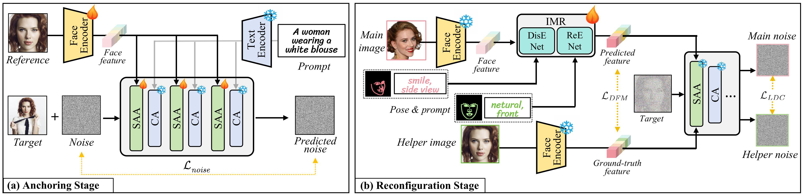
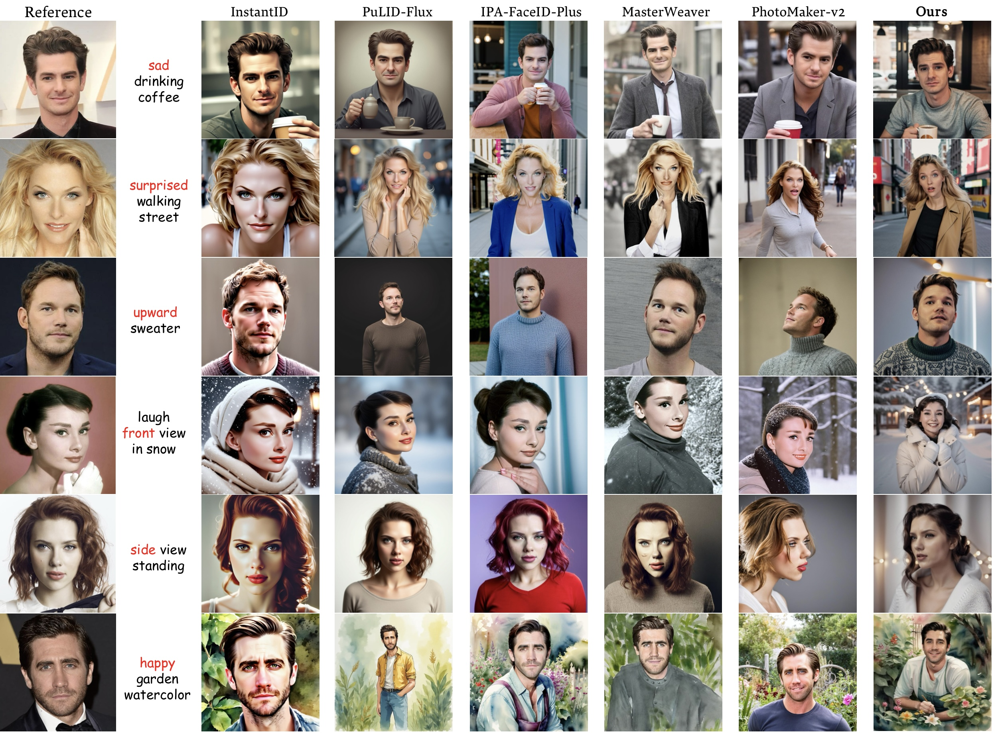
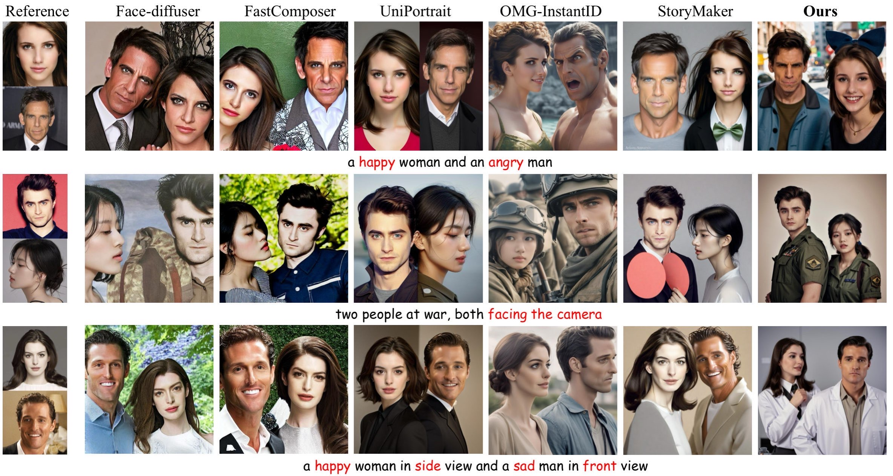

<div align="center">
# DynamicID: Zero-Shot Multi-ID Image Personalization with Flexible Facial Editability

### [ICCV 2025]

[](https://arxiv.org/abs/2503.06505) &ensp; [](https://arxiv.org/abs/2503.06505) &ensp; [](https://ByteCat-bot.github.io/DynamicID-webpage/)
</div>

---
This is the official implementation of DynamicID, a framework that generates visually harmonious image featuring **multiple individuals**. Each person in the image can be specified through user-provided reference images, and most notably, our method enables **independent control of each individual's facial expression** via text prompts. Hope you have fun with this demo!

---

## 🔍 Abstract

Recent advancements in text-to-image generation have spurred interest in personalized human image generation. Although existing methods achieve high-fidelity identity preservation, they often struggle with **limited multi-ID usability** and **inadequate facial editability**. 

We present DynamicID, a tuning-free framework that inherently facilitates both single-ID and multi-ID personalized generation with high fidelity and flexible facial editability. Our key innovations include: 

- Semantic-Activated Attention (SAA), which employs query-level activation gating to minimize disruption to the original model when injecting ID features and achieve multi-ID personalization without requiring multi-ID samples during training. 

- Identity-Motion Reconfigurator (IMR), which applies feature-space manipulation to effectively disentangle and reconfigure facial motion and identity features, supporting flexible facial editing.

- A task-decoupled training paradigm that reduces data dependency

- A curated VariFace-10k facial dataset, comprising 10k unique individuals, each represented by 35 distinct facial images. 

Experimental results demonstrate that DynamicID outperforms state-of-the-art methods in identity fidelity, facial editability, and multi-ID personalization capability.

## 💡 Method

<div align="center">
    
</div>

The proposed framework is architected around two core components: SAA and IMR. (a) In the anchoring stage, we jointly optimize the SAA and a face encoder to establish robust single-ID and multi-ID personalized generation capabilities. (b) Subsequently in the reconfiguration stage, we freeze these optimized components and leverage them to train the IMR for flexible and fine-grained facial editing.

## 🌈 Gallery

<div align="center">
    
    <br><br><br>
    
    <br><br><br>
    
</div>

## 📌 ToDo List

- [x] Release technical report
- [x] Release **training and inference code**
- [ ] Release **Dynamic-sd** (based on *stable diffusion v1.5*)  
- [ ] Release **Dynamic-flux** (based on *Flux-dev*)
- [ ] Release a Hugging Face Demo Space

## 📖 Citation
If you are inspired by our work, please cite our paper.
```bibtex
@inproceedings{dynamicid,
      title={DynamicID: Zero-Shot Multi-ID Image Personalization with Flexible Facial Editability},
      author={Xirui Hu,
              Jiahao Wang,
              Hao Chen,
              Weizhan Zhang,
              Benqi Wang,
              Yikun Li,
              Haishun Nan
              },
      booktitle={International Conference on Computer Vision},
      year={2025}
    }
    
```
